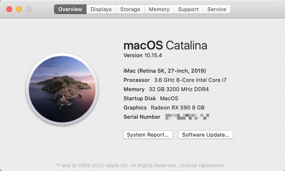

## Overview
An OpenCore config verified working with macOS version 10.15.4 (19E2269) Catalina

## Tips
- Make sure **GENERATE NEW Serial Number & SmUUID** by yourself.
- The USB cable for FV-T919 should be plugged into the  **F_USB1** slot on the motherboard.

## Computer Configuration
Component | Brand
-|-
CPU | Intel i7 9700K
MotherBoard | Gigabyte Z390M Gaming
Memory | G.SKILL Sniper X 16G DDR4 3200MHz x2
Graphic Card | Sapphire NITRO+ RX 590 8G G5
SSD1 | WD Blue SN500 NVMe SSD 500GB (for macOS)
SSD2 | WD Blue SN550 NVMe SSD 1TB (for Windows 10)
WiFi/Bluetooth Card | Fenvi FV-T919 (BCM94360CD)
Power | Super Flower GX550
Case | InWin 301 Black

## What's working?
- Both GPUs are working fine
- Sleep
- BlueTooth and Wi-Fi, thanks to Fenvi FV-T919
- iCloud
- iMessage & Facetime
- Apple Music
- Handoff
- AirDrop
- Sidecar
- AirPods Pro & HomePod

## BIOS Changes
BIOS version: F9g

Comes from [tonymacx86](https://www.tonymacx86.com/threads/success-jbarnettes-build-gigabyte-z390-m-gaming-i9-9900k-sapphire-rx-vega-64-8gb-32gb-ram-macos-10-14-3-w-usb3-working.273381/).

- Save & Exit
    - Load Optimized Defaults then make (or confirm) the following settings -- important settings in **bold**:
- M.I.T.
    - Extreme Memory Profile (X.M.P.) → **Profile 1**
- BIOS
    - Windows 8/10 Features → **Other OS**
    - CSM Support → **Disable**
        - Secure Boot will be disabled by default, but good to check
- Peripherals
    - Initial Display Output → PCIe Slot 1. If your discrete graphics card is in Slot 2, change this appropriately.
    - Intel Platform Trust Technology (PTT) → Disabled
    - Thunderbolt(TM) Configuration
        - TBT Vt-d Base Security → **Disabled**
        - Thunderbolt Boot Support → **Disabled**
        - Security Level → **No Security**
    - USB Configuration
        - Legacy USB Support → Enabled
        - XHCI Hand-off → **Enabled**
    - Network Stack Configuration
        - Network Stack → **Disabled**
- Chipset
    - Vt-d → **Disabled**
    - Internal Graphics → **Enabled**
    - DVMT Pre-Alloc → 64M
    - DVMT Total Gfx Mem → 256M
    - Audio Controller → **Enabled**
    - Above 4G Decoding → **Enabled**
- Power
    - ErP → Disabled
    - RC6 (Render Standby) → Enabled

## References
Many thanks to:
- https://github.com/iGuan7u/OpenCore-Gigabyte-Z390M-Gaming
- https://github.com/BenjaminX/Hackintosh-Gigabyte-Z390M-GAMING
- https://www.tonymacx86.com/threads/gigabyte-z390-m-gaming-build-with-working-nvram.291193/